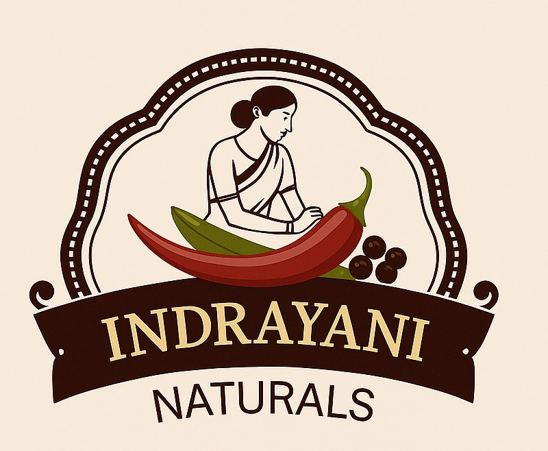

# Indrayani Naturals - Premium Indian Spices Website

A modern, responsive website for Indrayani Naturals, a premium Indian spice company. This project features a beautiful UI with AI-powered chatbot assistance, comprehensive product showcase, and recipe collections.



## 🌟 Features

### 🏠 **Home Page**
- Hero section with dynamic image carousel
- Featured products showcase
- Company highlights and testimonials
- Call-to-action sections
- Smooth animations and transitions

### 🛍️ **Products Page**
- Complete product catalog with high-quality images
- Detailed product descriptions and pricing
- Product categories and filtering
- Interactive product cards with hover effects

### 📖 **Recipes Page**
- Traditional Indian recipes using company spices
- Step-by-step cooking instructions
- Beautiful recipe imagery
- Recipe categories and search functionality

### ℹ️ **About Us Page**
- Company story and mission
- Team information
- Company values and heritage
- Professional imagery and testimonials

### 📞 **Contact Page**
- Contact form with validation
- Company location and map
- Business hours and contact details
- Social media links

### 🤖 **AI Chatbot System**
- **OpenAI GPT-3.5-turbo Integration**: Intelligent responses about products, recipes, and inquiries
- **Fallback System**: Comprehensive responses when AI is unavailable
- **Real-time Status**: Shows AI availability status
- **Multi-page Integration**: Works seamlessly across all website pages
- **Modern UI**: Beautiful gradient design with smooth animations
- **Responsive Design**: Perfect on desktop, tablet, and mobile
- **Accessibility**: Full keyboard navigation and screen reader support

## 🚀 Technology Stack

- **Frontend**: HTML5, CSS3, JavaScript (ES6+)
- **Framework**: Bootstrap 5.3.0
- **Icons**: Font Awesome 6.0.0
- **Fonts**: Google Fonts (Poppins)
- **AI Integration**: OpenAI GPT-3.5-turbo API
- **Animations**: Custom CSS animations and JavaScript
- **SEO**: Structured data and meta tags

## 📁 Project Structure

```
IndrayaniNaturals/
├── 📄 index.html                 # Home page
├── 📁 pages/                     # Additional pages
│   ├── about.html               # About Us page
│   ├── contact.html             # Contact page
│   ├── products.html            # Products catalog
│   └── recipes.html             # Recipes collection
├── 📁 css/                      # Stylesheets
│   ├── style.css               # Main styles
│   ├── home.css                # Home page styles
│   ├── products.css            # Products page styles
│   ├── recipes.css             # Recipes page styles
│   ├── about.css               # About page styles
│   ├── contact.css             # Contact page styles
│   ├── ai-chatbot.css          # AI chatbot styles
│   ├── animations.css          # Animation styles
│   └── home-animations.css     # Home page animations
├── 📁 js/                       # JavaScript files
│   ├── main.js                 # Main functionality
│   ├── home.js                 # Home page scripts
│   ├── products.js             # Products page scripts
│   ├── recipes.js              # Recipes page scripts
│   ├── contact.js              # Contact page scripts
│   ├── animations.js           # Animation scripts
│   ├── ai-chatbot.js           # AI chatbot functionality
│   ├── api-config.js           # API configuration
│   └── chatbot-init.js         # Chatbot initialization
├── 📁 images/                   # Image assets
│   ├── logo.png               # Company logo
│   ├── hero/                  # Hero section images
│   ├── products/              # Product images
│   ├── recipes/               # Recipe images
│   └── about/                 # About page images
├── 📁 config/                  # Configuration files
│   ├── api-keys.template.json # API keys template
│   └── api-keys.json          # API keys (gitignored)
└── 📄 Documentation
    ├── AI_CHATBOT_README.md   # AI chatbot documentation
    └── CHATBOT_RESPONSES_GUIDE.txt # Chatbot response guide
```

## 🛠️ Installation & Setup

### Prerequisites
- Modern web browser (Chrome, Firefox, Safari, Edge)
- OpenAI API key (for AI chatbot functionality)
- Web server (for local development)

### Quick Start

1. **Clone the repository**
   ```bash
   git clone <repository-url>
   cd IndrayaniNaturals
   ```

2. **Setup AI Chatbot (Optional)**
   ```bash
   # Copy the API configuration template
   cp config/api-keys.template.json config/api-keys.json
   
   # Edit config/api-keys.json and add your OpenAI API key
   {
     "openai": {
       "apiKey": "your-openai-api-key-here",
       "model": "gpt-3.5-turbo",
       "maxTokens": 500,
       "temperature": 0.7
     }
   }
   ```

3. **Run the website**
   - Open `index.html` in your web browser, or
   - Use a local web server:
     ```bash
     # Using Python
     python -m http.server 8000
     
     # Using Node.js
     npx serve .
     
     # Using PHP
     php -S localhost:8000
     ```

4. **Access the website**
   - Navigate to `https://indrayaninaturals.com/` in your browser

## 🎨 Customization

### Styling
- Modify `css/style.css` for global styles
- Edit page-specific CSS files for individual page styling
- Update `css/animations.css` for custom animations

### Content
- Update product information in `pages/products.html`
- Modify recipes in `pages/recipes.html`
- Edit company information in `pages/about.html`
- Update contact details in `pages/contact.html`

### AI Chatbot
- Configure responses in `CHATBOT_RESPONSES_GUIDE.txt`
- Modify chatbot behavior in `js/ai-chatbot.js`
- Update API settings in `js/api-config.js`

## 📱 Responsive Design

The website is fully responsive and optimized for:
- **Desktop**: 1200px and above
- **Tablet**: 768px - 1199px
- **Mobile**: 320px - 767px

## 🔧 Browser Support

- Chrome 90+
- Firefox 88+
- Safari 14+
- Edge 90+

## 🚀 Performance Features

- **Optimized Images**: Compressed and properly sized
- **Lazy Loading**: Images load as needed
- **Minified CSS/JS**: Reduced file sizes
- **CDN Resources**: Fast loading external libraries
- **SEO Optimized**: Meta tags and structured data

## 🤖 AI Chatbot Features

### Capabilities
- Product information and pricing
- Recipe recommendations
- Order inquiries
- General company information
- Multi-language support (English/Hindi)

### Keywords Recognized
- Product names: "garam masala", "biryani masala", "chicken masala"
- General queries: "products", "prices", "contact", "about"
- Recipe requests: "recipes", "how to cook", "biryani recipe"

## 📞 Support

For technical support or questions:
- Check the `AI_CHATBOT_README.md` for chatbot setup
- Review `CHATBOT_RESPONSES_GUIDE.txt` for response customization
- Contact the development team for additional assistance

## 📄 License

This project is licensed under the Apache License 2.0 - see the [LICENSE](LICENSE) file for details.


## 📊 Project Status

- ✅ Home page complete
- ✅ Products page complete
- ✅ Recipes page complete
- ✅ About page complete
- ✅ Contact page complete
- ✅ AI chatbot integration complete
- ✅ Responsive design complete
- ✅ SEO optimization complete

---

**Indrayani Naturals** - Bringing authentic Indian flavors to your kitchen since 2025. 🌶️✨
